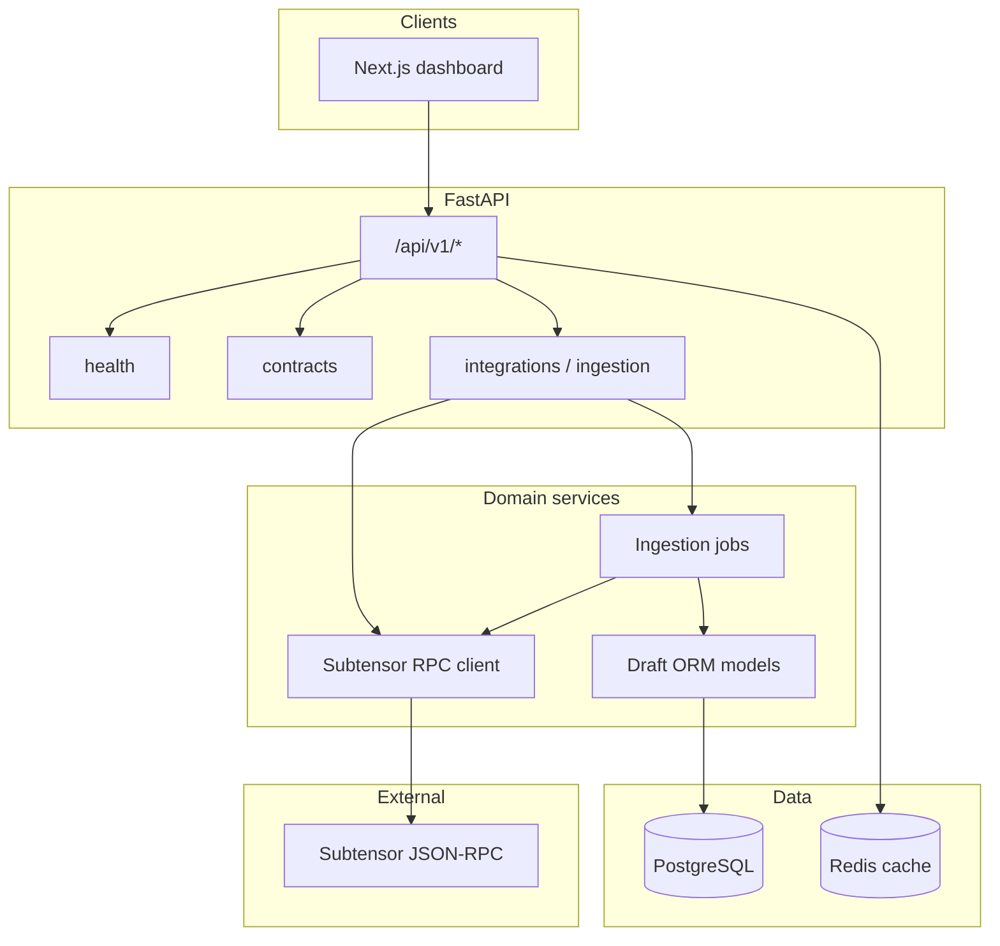

# Phase 1 architecture

High-level view of research outputs, ingestion spike, and draft persistence for StakeMind.

## Module responsibilities

| Module | Phase 1 responsibility |
| --- | --- |
| `integrations/bittensor` | Read-only JSON-RPC client with retries, timeouts, and typed responses |
| `ingestion` | Bounded, idempotent spike jobs keyed by chain watermark |
| `database/models` | Draft schema for validators, subnets, stakes, rewards, sessions, audit events |
| `docs/phase1` | Staking flows, competitor matrix, pain points, positioning, data model |

## Security boundaries

- No private keys or signing in backend services.
- Wallet sessions store address metadata and expiry only.
- Audit events capture actor, action, and outcome without secret material.

## Phase 2 handoff

- Promote ingestion spike into scheduled sync jobs.
- Expose read APIs on top of normalized tables and Redis-backed aggregates.
- Connect the frontend dashboard to versioned API responses.
