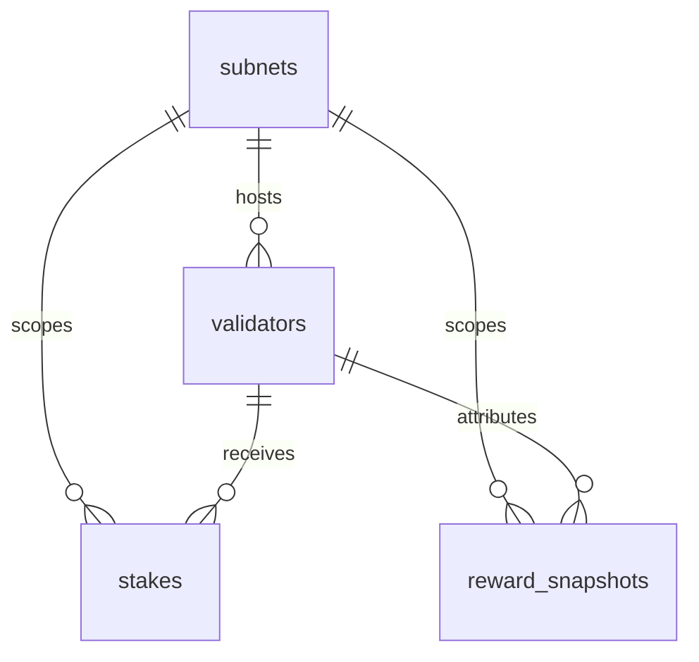

# Draft data model

Phase 1 persistence draft for PostgreSQL. Amounts are stored in rao (smallest unit) as integers to avoid floating-point drift.

## Entity overview

| Table | Purpose |
| --- | --- |
| `subnets` | Subnet catalog keyed by `netuid` |
| `validators` | Validator hotkeys scoped to a subnet |
| `stakes` | Delegated stake by wallet and validator |
| `reward_snapshots` | Historical reward points by wallet and subnet |
| `wallet_sessions` | Connected wallet session metadata (no private keys) |
| `audit_events` | Security and action audit trail |
| `ingestion_runs` | Idempotent ingestion job outcomes |

## Relationships

## Key constraints

- `wallet_sessions` never stores private keys or mnemonics.
- `ingestion_runs.idempotency_key` is unique per job execution window.
- `stakes` uniqueness on `(wallet_address, validator_hotkey, subnet_id)`.
- `validators` uniqueness on `(hotkey, subnet_id)`.

## Implementation

SQLAlchemy models live in `backend/app/database/models/`. Schema migration: `0002_phase1`.
